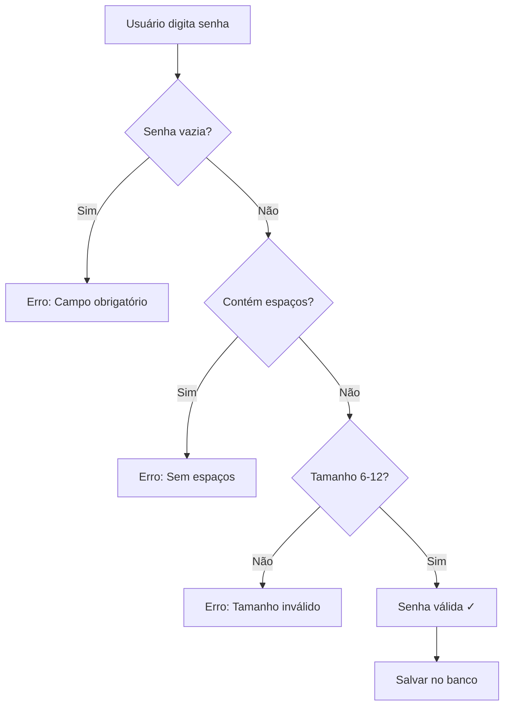

# Validação de Senha - Documentação

## Restrições Implementadas

A validação de senha foi aprimorada com as seguintes restrições:

### Regras de Validação

1. **Tamanho Mínimo**: 6 caracteres
2. **Tamanho Máximo**: 12 caracteres
3. **Caracteres Permitidos**:
   - ✅ Letras maiúsculas (A-Z)
   - ✅ Letras minúsculas (a-z)
   - ✅ Números (0-9)
   - ✅ Caracteres especiais (!@#$%^&*()_+-={}[]|:;"'<>,.?/~`)
4. **Caracteres Proibidos**:
   - ❌ Espaços (em qualquer posição)

### Exemplos de Senhas Válidas

```
✅ abc123          (6 caracteres - mínimo)
✅ Senha@1         (7 caracteres com especial)
✅ MinhaSenh@1     (11 caracteres mistos)
✅ SenhaForte1!    (12 caracteres - máximo)
✅ SENHA123        (maiúsculas e números)
✅ senha123        (minúsculas e números)
✅ !@#$%^&*        (apenas caracteres especiais)
```

### Exemplos de Senhas Inválidas

```
❌ abc12           (apenas 5 caracteres - muito curta)
❌ SenhaForte123   (13 caracteres - muito longa)
❌ senha com espaco (contém espaços)
❌ Sen ha1         (espaço no meio)
❌ (vazia)         (senha em branco)
```

## Implementação Técnica

### Arquivos Modificados

#### 1. `gui/register_screen.py`

**Localização**: Método `_registrar()`, linhas ~290-306

**Validação Implementada**:
```python
# Validação de senha: 6-12 caracteres, sem espaços
if ' ' in senha:
    messagebox.showerror("Erro", "A senha não pode conter espaços.")
    self.senha_entry.focus()
    return

if len(senha) < 6 or len(senha) > 12:
    messagebox.showerror("Erro", 
        "A senha deve ter entre 6 e 12 caracteres.\n" +
        "Aceita letras maiúsculas, minúsculas, números e caracteres especiais.")
    self.senha_entry.focus()
    return
```

**Label do Campo Atualizado**:
```python
text="Senha (6 a 12 caracteres, sem espaços):"
```

#### 2. `gui/admin_panel.py`

**Localização**: Método `_salvar()` da classe `EditUserDialog`, linhas ~338-353

**Validação Implementada**:
```python
# Validação de senha: 6-12 caracteres, sem espaços
if senha:
    if ' ' in senha:
        messagebox.showerror("Erro", "A senha não pode conter espaços.")
        return
    
    if len(senha) < 6 or len(senha) > 12:
        messagebox.showerror("Erro", 
            "A senha deve ter entre 6 e 12 caracteres.\n" +
            "Aceita letras maiúsculas, minúsculas, números e caracteres especiais.")
        return
```

## Mensagens de Erro

### Senha com Espaços
```
"A senha não pode conter espaços."
```

### Senha Fora do Intervalo (6-12)
```
"A senha deve ter entre 6 e 12 caracteres.
Aceita letras maiúsculas, minúsculas, números e caracteres especiais."
```

## Testes Automatizados

### Script de Teste 1: `scripts/teste_validacao_senha.py`

Testa 15 casos de validação de senha:
- ✅ Senhas válidas (6-12 caracteres)
- ✅ Senhas muito curtas (< 6 caracteres)
- ✅ Senhas muito longas (> 12 caracteres)
- ✅ Senhas com espaços
- ✅ Diferentes combinações de caracteres

**Executar**:
```bash
python scripts/teste_validacao_senha.py
```

**Resultado Esperado**: 15/15 testes passando

### Script de Teste 2: `scripts/teste_cadastro_senha.py`

Testa integração com banco de dados:
- ✅ Cadastro de usuários com senhas válidas
- ✅ Rejeição de senhas inválidas
- ✅ Verificação de usuários cadastrados

**Executar**:
```bash
python scripts/teste_cadastro_senha.py
```

**Resultado Esperado**: 8/8 testes passando

## Fluxo de Validação



## Impacto nas Telas

### 1. Tela de Registro (`RegisterScreen`)
- Campo de senha com hint atualizado
- Validação em tempo de cadastro
- Mensagens de erro claras
- Foco automático no campo após erro

### 2. Painel Admin (`AdminPanel`)
- Validação ao adicionar novo usuário
- Validação ao editar senha de usuário existente
- Mensagens consistentes com tela de registro

## Segurança

As senhas continuam sendo:
- ✅ Armazenadas como hash SHA-256 no banco
- ✅ Nunca exibidas em texto plano
- ✅ Validadas no lado do cliente (GUI)
- ✅ Validadas no lado do servidor (database.py)

## Compatibilidade

Esta implementação mantém compatibilidade com:
- ✅ Banco de dados SQLite existente
- ✅ Banco de dados MySQL (opcional)
- ✅ Usuários já cadastrados
- ✅ Sistema de autenticação atual

## Próximas Melhorias Sugeridas

1. **Força da Senha**: Indicador visual de força da senha
2. **Requisitos Mínimos**: Exigir pelo menos um número, uma letra maiúscula, etc.
3. **Histórico de Senhas**: Evitar reutilização de senhas antigas
4. **Expiração de Senha**: Solicitar troca periódica
5. **Bloqueio por Tentativas**: Bloquear após N tentativas incorretas

## Data de Implementação

**Data**: 18 de Março de 2026  
**Versão**: 1.0  
**Autor**: GitHub Copilot  
**Status**: ✅ Implementado e Testado
